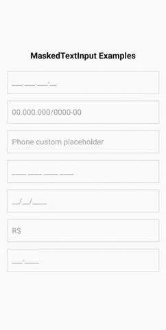
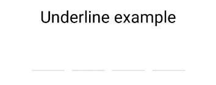

### Overview:
This is an chat app (whatsapp clone) with OTP verification built with expo.
Initial command after creating the project dir `npx npx create-expo-app@latest .`

Install Initial 3rd party packages by `npx expo install react-native-reanimated react-native-mask-input react-native-confirmation-code-field expo-dev-client`

Note: Configure Reanimated as stated in the docs


Then go prebuild (expo-dev-client already installed) => `npx expo run:android`

### KeyboardAvoidingView:
This component will automatically adjust its height, position, or bottom padding based on the keyboard height to remain visible while the virtual keyboard is displayed.

```jsx
const KeyboardAvoidingComponent = () => {
  return (
    <KeyboardAvoidingView
      behavior={Platform.OS === 'ios' ? 'padding' : 'height'}
      style={styles.container}>
      <TouchableWithoutFeedback onPress={Keyboard.dismiss}>
        <View style={styles.inner}>
          <Text style={styles.header}>Header</Text>
          <TextInput placeholder="Username" style={styles.textInput} />
          <View style={styles.btnContainer}>
            <Button title="Submit" onPress={() => null} />
          </View>
        </View>
      </TouchableWithoutFeedback>
    </KeyboardAvoidingView>
  );
};

const styles = StyleSheet.create({
  container: {
    flex: 1,
  },
  inner: {
    padding: 24,
    flex: 1,
    justifyContent: 'space-around',
  },
  header: {
    fontSize: 36,
    marginBottom: 48,
  },
  textInput: {
    height: 40,
    borderColor: '#000000',
    borderBottomWidth: 1,
    marginBottom: 36,
  },
  btnContainer: {
    backgroundColor: 'white',
    marginTop: 12,
  },
});

export default KeyboardAvoidingComponent;
```

### Mask Input:
`npm install react-native-mask-input` to mask (decorate) texts and digits input, ie, phone number, otp or other code

Example:



--------------Code-----------------
```js
import MaskInput from 'react-native-mask-input';

function MyComponent() {
  const [phone, setPhone] = React.useState('');

  return (
    <MaskInput
      value={phone}
      onChangeText={(masked, unmasked) => {
        setPhone(masked); // you can use the unmasked value as well

        // assuming you typed "9" all the way:
        console.log(masked); // (99) 99999-9999
        console.log(unmasked); // 99999999999
      }}
      mask={['(', /\d/, /\d/, ')', ' ', /\d/, /\d/, /\d/, /\d/, /\d/, '-', /\d/, /\d/, /\d/, /\d/]}
    />
  );
}
```

### StyleSheet (.create() | .absoluteFill | .hairlineWidth | .absoluteFillObject):
`StyleSheet.create({})` is the mostly used utility function to create modular style declaration for React Native Application.

there are some predefined set of style, ie, `.absoluteFill`, `.hairlineWidth`, `.absoluteFillObject` with the StyleSheet Object.

Docs https://reactnative.dev/docs/stylesheet

### ActivityIndicator Component:
Built-in component to show os specific loading indicator.

```js
{!loading && (
  <View style={[StyleSheet.absoluteFill, styles.loading]}>
    <ActivityIndicator size="large" color={Colors.primary} />
    <Text style={{ fontSize: 18, padding: 10 }}>Updating...</Text>
  </View>
)}
```

### react-native-confirmation-code-field:
Used to add frontend confirmation code input field, ie, otp, sohw/hide password, social security etc.

Example




```js
import React, {useState} from 'react';
import {SafeAreaView, Text, StyleSheet} from 'react-native';

import {
  CodeField,
  Cursor,
  useBlurOnFulfill,
  useClearByFocusCell,
} from 'react-native-confirmation-code-field';

const styles = StyleSheet.create({
  root: {flex: 1, padding: 20},
  title: {textAlign: 'center', fontSize: 30},
  codeFieldRoot: {marginTop: 20},
  cell: {
    width: 40,
    height: 40,
    lineHeight: 38,
    fontSize: 24,
    borderWidth: 2,
    borderColor: '#00000030',
    textAlign: 'center',
  },
  focusCell: {
    borderColor: '#000',
  },
});

const CELL_COUNT = 6;

const App = () => {
  const [value, setValue] = useState('');
  const ref = useBlurOnFulfill({value, cellCount: CELL_COUNT});
  const [props, getCellOnLayoutHandler] = useClearByFocusCell({
    value,
    setValue,
  });

  return (
    <SafeAreaView style={styles.root}>
      <Text style={styles.title}>Verification</Text>
      <CodeField
        ref={ref}
        {...props}
        // Use `caretHidden={false}` when users can't paste a text value, because context menu doesn't appear
        value={value}
        onChangeText={setValue}
        cellCount={CELL_COUNT}
        rootStyle={styles.codeFieldRoot}
        keyboardType="number-pad"
        textContentType="oneTimeCode"
        autoComplete={Platform.select({ android: 'sms-otp', default: 'one-time-code' })}
        testID="my-code-input"
        renderCell={({index, symbol, isFocused}) => (
          <Text
            key={index}
            style={[styles.cell, isFocused && styles.focusCell]}
            onLayout={getCellOnLayoutHandler(index)}>
            {symbol || (isFocused ? <Cursor/> : null)}
          </Text>
        )}
      />
    </SafeAreaView>
  );
};

export default App;
```

### Clerk Setup
`npm install @clerk/clerk-expo`
`npx expo install install expo-secure-store`

Clerk Test Mode => Dashboard -> Settings -> Enable Test Mode and See Testing Email, Phone Number and OTP verification code
Test phone number:+15555550100 to 199
Test verification code:424242
Test email:your_email+clerk_test@example.com

### Expo OTA updates:
Docs https://docs.expo.dev/versions/latest/sdk/updates/

### `rendered more hooks than previous` Error Debug:
Don't return early before any hooks. `return` will always be the last declaration of a react Component.

https://stackoverflow.com/questions/55622768/uncaught-invariant-violation-rendered-more-hooks-than-during-the-previous-rende

### Expo URL hooks:
`useFocusEffect` runs when a component is focused
`useGlobalSearchParams` Returns the URL parameters for the globally selected route
`useLocalSearchParams` Returns the URL parameters for the contextually selected route
https://docs.expo.dev/router/reference/url-parameters/#local-versus-global-url-parameters

`useNavigation` Access the underlying React Navigation navigation prop to imperatively access layout-specific functionality like navigation.dispatch(DrawerActions.openDrawer()) in a Drawer layout

`usePathname` Returns the currently selected route location without search parameters. For example, /acme?foo=bar -> /acme. Segments will be normalized: /[id]?id=normal -> /normal

`useSegments` Returns a list of segments for the currently selected route. Segments are not normalized so that they will be the same as the file path. For example, /[id]?id=normal -> ["[id]"].

https://docs.expo.dev/router/reference/hooks/

### Installing Reactive Native on Mac (ios + android):
Docs : https://reactnative.dev/docs/set-up-your-environment

```sh
# For both ios and android
brew install node
brew install watchman
```

To setup android dev environment
=> Install java (azul zulu build, zulu@17)
  - Download by `brew install --cask zulu@17`
  - find the downloaded file by `brew info --cask zulu@17`, open it by clicking the link on the terminal and then run the installer (double click)
=> Set default JAVA by adding JAVA_HOME to the ~/.zshrc or ~/.bash-profile (add if it doesn't exists). Find all the Azul Zulu installed java version by `ls -1 /Library/Java/JavaVirtualMachines/` (https://docs.azul.com/core/manage-multiple-zulu-versions/macos)

ie, `export JAVA_HOME=/Library/Java/JavaVirtualMachines/zulu-17.jdk/Contents/Home`


=> Check if it's been set by `echo $JAVA_HOME` (sometimes it may need to logout and login again)

=> Install `JetBrains toolbox` first then install Android Studio throw that (it will be easier to update/manage multiple Android Studio IDE versions)

=> install an android emulator

=> add this to ~/.zshrc after $JAVA_HOME
```sh
export ANDROID_HOME=$HOME/Library/Android/sdk
export PATH=$PATH:$ANDROID_HOME/emulator
export PATH=$PATH:$ANDROID_HOME/platform-tools
```

### Attempted to navigate before mounting the Root Layout component:
This can happen if the root layout file returns non navigational component (not Stack or Slot) at any point. Just returning Slot in case of loading state will solve these issues.

### useEffect and useLayoutEffect timings:
- skip useEffect on first render => custom hook with useRef conditional
https://stackoverflow.com/questions/53179075/with-useeffect-how-can-i-skip-applying-an-effect-upon-the-initial-render

- call function before useEffect (useEffects are called after browser finished painting) => useRef conditional or useLayoutEffect for rerenders
https://stackoverflow.com/questions/51741828/need-to-execute-function-before-render-in-reactjs